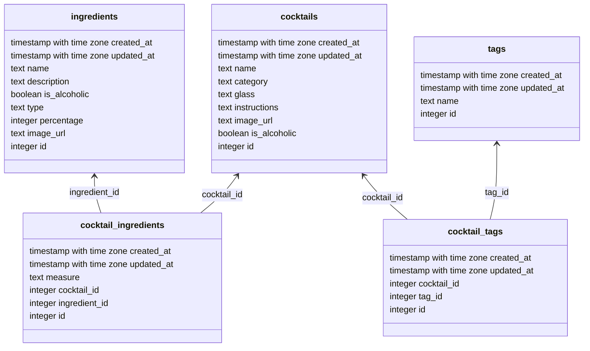

# Solvro backend

## Development

### Install dependenceis

```bash
pnpm install
```

### Environment variables

Example content of .env file matching [docker-compose.yml](docker-compose.yml) setup.

```env
TZ=UTC
PORT=3333
HOST=localhost
LOG_LEVEL=info
APP_KEY=
NODE_ENV=development
DB_HOST=127.0.0.1
DB_PORT=5432
DB_USER=postgres
DB_PASSWORD=
DB_DATABASE=solvro_backend
```

For more details on defining environment variables read [AdonisJS - Defining environment variables](https://docs.adonisjs.com/guides/getting-started/environment-variables#defining-environment-variables).

### Database

```bash
docker compose up -d
```

#### Migration

```bash
node ace migration:fresh
```

#### Run

```bash
pnpm dev
```

#### Schema


